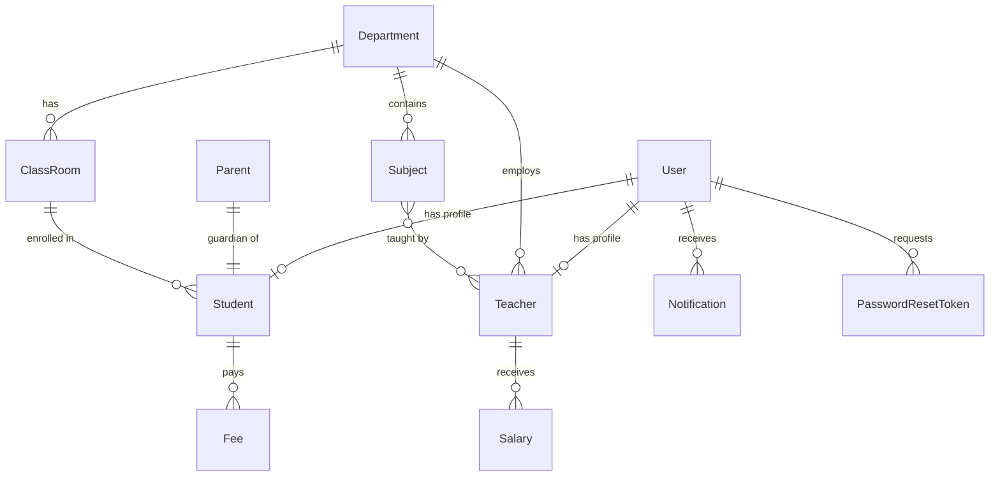

# 📋 Student Management System — Full Detailed Report

---

## 1. Project Overview

**Project Name:** SchoolMS (Student Management System)
**Framework:** Django 5.2.15
**Python Version:** 3.11
**Database:** SQLite3
**UI Design:** Premium dark-mode glassmorphism with Inter font

SchoolMS is a full-featured, role-based web application for managing the academic and financial operations of an educational institution. It supports **three user roles** — Admin, Teacher, and Student — each with a dedicated dashboard and permission-restricted access.

---

## 2. Technology Stack

| Layer | Technology |
|---|---|
| **Backend** | Python 3.11 + Django 5.2.15 |
| **Database** | SQLite3 (`db.sqlite3`) |
| **Frontend** | HTML5, CSS3 (Vanilla), JavaScript (ES6) |
| **Charts** | Chart.js 4.4.0 |
| **Icons** | Font Awesome 6.5.1 |
| **Typography** | Google Fonts — Inter (300–800 weights) |
| **Image Processing** | Pillow 12.2.0 |
| **Virtual Environment** | `env/` (venv) |
| **Email Backend** | Console (development) |

---

## 3. Project Structure

```
Student Management System/
└── Home/                              ← Django project root
    ├── manage.py                      ← Django CLI entry point
    ├── db.sqlite3                     ← SQLite database (262 KB)
    ├── env/                           ← Python virtual environment
    │
    ├── Home/                          ← Project configuration package
    │   ├── __init__.py
    │   ├── settings.py                ← Django settings (141 lines)
    │   ├── urls.py                    ← Root URL configuration
    │   ├── wsgi.py                    ← WSGI application
    │   └── asgi.py                    ← ASGI application
    │
    └── school/                        ← Main application
        ├── __init__.py
        ├── apps.py                    ← App configuration + signal registration
        ├── models.py                  ← 11 database models (226 lines)
        ├── views.py                   ← 30+ views (796 lines)
        ├── urls.py                    ← 27 URL patterns (56 lines)
        ├── forms.py                   ← 11 form classes (245 lines)
        ├── admin.py                   ← 11 admin registrations (75 lines)
        ├── signals.py                 ← Auto-notification signals (25 lines)
        ├── context_processors.py      ← Global notification count (10 lines)
        ├── tests.py                   ← RBAC unit tests (75 lines)
        │
        ├── migrations/
        │   └── 0001_initial.py        ← Initial schema migration
        │
        ├── static/school/
        │   ├── css/style.css          ← Full design system (1,860+ lines)
        │   └── js/main.js             ← Client-side logic (153 lines)
        │
        └── templates/
            ├── base.html              ← Master layout with sidebar + navbar
            ├── registration/
            │   ├── login.html
            │   ├── signup.html
            │   ├── password_reset.html
            │   └── password_reset_confirm.html
            ├── dashboards/
            │   ├── admin_dashboard.html
            │   ├── teacher_dashboard.html
            │   └── student_dashboard.html
            ├── students/
            │   ├── student_list.html
            │   ├── student_form.html
            │   └── student_confirm_delete.html
            ├── teachers/
            │   ├── teacher_list.html
            │   ├── teacher_form.html
            │   └── teacher_confirm_delete.html
            ├── departments/
            │   ├── department_list.html
            │   ├── department_form.html
            │   └── department_confirm_delete.html
            ├── subjects/
            │   ├── subject_list.html
            │   ├── subject_form.html
            │   └── subject_confirm_delete.html
            ├── accounts/
            │   ├── fee_list.html
            │   ├── fee_form.html
            │   ├── expense_list.html
            │   ├── expense_form.html
            │   ├── salary_list.html
            │   └── salary_form.html
            └── notifications/
                └── notification_list.html
```

**Total template files:** 25
**Total Python files:** 10 (in `school/` app)

---

## 4. Database Models (11 Models)

### 4.1 User (Custom — extends `AbstractUser`)
| Field | Type | Notes |
|---|---|---|
| `username` | CharField | Inherited from AbstractUser |
| `email` | EmailField | Inherited |
| `first_name` | CharField | Inherited |
| `last_name` | CharField | Inherited |
| `password` | CharField | Inherited (hashed) |
| `is_student` | BooleanField | Role flag (default: False) |
| `is_teacher` | BooleanField | Role flag (default: False) |
| `is_admin` | BooleanField | Role flag (default: False) |

> [!IMPORTANT]
> The User model is set as `AUTH_USER_MODEL = 'school.User'` in settings.py. Django superusers (`is_superuser=True`) are also treated as admins in the application.

### 4.2 Department
| Field | Type | Notes |
|---|---|---|
| `name` | CharField(200) | Department name |
| `head` | CharField(200) | Head of department (optional) |
| `description` | TextField | Optional description |
| `created_at` | DateTimeField | Auto-set on creation |

### 4.3 Subject
| Field | Type | Notes |
|---|---|---|
| `name` | CharField(200) | Subject name |
| `code` | CharField(20) | Unique code (e.g., "CS101") |
| `department` | ForeignKey → Department | CASCADE on delete |
| `description` | TextField | Optional description |

### 4.4 ClassRoom
| Field | Type | Notes |
|---|---|---|
| `name` | CharField(100) | Class name (e.g., "Grade 10") |
| `section` | CharField(10) | Section label (e.g., "A") |
| `department` | ForeignKey → Department | SET_NULL on delete |

### 4.5 Parent
| Field | Type | Notes |
|---|---|---|
| `father_name` | CharField(200) | Required |
| `mother_name` | CharField(200) | Optional |
| `father_occupation` | CharField(200) | Optional |
| `mother_occupation` | CharField(200) | Optional |
| `mobile_number` | CharField(20) | Required |
| `email` | EmailField | Optional |
| `present_address` | TextField | Required |
| `permanent_address` | TextField | Optional |

### 4.6 Student
| Field | Type | Notes |
|---|---|---|
| `user` | OneToOneField → User | Optional link to login account |
| `parent` | OneToOneField → Parent | CASCADE on delete |
| `first_name` | CharField(100) | |
| `last_name` | CharField(100) | |
| `student_id` | CharField(20) | **Unique** identifier |
| `gender` | CharField(10) | Choices: Male, Female, Other |
| `date_of_birth` | DateField | |
| `classroom` | ForeignKey → ClassRoom | SET_NULL on delete |
| `religion` | CharField(50) | Optional |
| `joining_date` | DateField | |
| `mobile_number` | CharField(20) | Optional |
| `admission_number` | CharField(20) | **Unique** |
| `section` | CharField(10) | Optional |
| `profile_image` | ImageField | Upload path: `students/profiles/` |

**Properties:** `full_name` → returns `"first_name last_name"`

### 4.7 Teacher
| Field | Type | Notes |
|---|---|---|
| `user` | OneToOneField → User | Optional link to login account |
| `first_name` | CharField(100) | |
| `last_name` | CharField(100) | |
| `mobile_number` | CharField(20) | Optional |
| `department` | ForeignKey → Department | SET_NULL on delete |
| `subjects` | ManyToManyField → Subject | Can teach multiple subjects |
| `profile_image` | ImageField | Upload path: `teachers/profiles/` |
| `joining_date` | DateField | Optional |

**Properties:** `full_name` → returns `"first_name last_name"`

### 4.8 Notification
| Field | Type | Notes |
|---|---|---|
| `user` | ForeignKey → User | CASCADE on delete |
| `message` | TextField | Notification content |
| `is_read` | BooleanField | Default: False |
| `created_at` | DateTimeField | Auto-set |

**Ordering:** Most recent first (`-created_at`)

### 4.9 Fee
| Field | Type | Notes |
|---|---|---|
| `student` | ForeignKey → Student | CASCADE on delete |
| `amount` | DecimalField(10,2) | |
| `fee_type` | CharField(100) | E.g., "Tuition", "Lab Fee" |
| `date` | DateField | Payment/due date |
| `status` | CharField(10) | Choices: Paid, Unpaid, Partial |

### 4.10 Expense
| Field | Type | Notes |
|---|---|---|
| `title` | CharField(200) | Expense name |
| `amount` | DecimalField(10,2) | |
| `date` | DateField | |
| `description` | TextField | Optional |

### 4.11 Salary
| Field | Type | Notes |
|---|---|---|
| `teacher` | ForeignKey → Teacher | CASCADE on delete |
| `amount` | DecimalField(10,2) | |
| `month` | CharField(20) | E.g., "January" |
| `year` | IntegerField | E.g., 2026 |
| `status` | CharField(10) | Choices: Paid, Pending |

### 4.12 PasswordResetToken
| Field | Type | Notes |
|---|---|---|
| `user` | ForeignKey → User | CASCADE on delete |
| `token` | CharField(100) | **Unique** secure token |
| `created_at` | DateTimeField | Auto-set |
| `is_used` | BooleanField | Default: False |

---

## 5. Entity Relationship Diagram



---

## 6. Authentication & Authorization

### 6.1 Authentication Flow
1. **Login** (`/login/`) — Username + password → Django's `authenticate()` → role-based redirect
2. **Signup** (`/signup/`) — Registration with role selection (Student or Teacher only; Admin role removed)
3. **Logout** (`/logout/`) — Session cleared → redirect to login
4. **Password Reset** (`/password-reset/`) — Email-based token reset (1-hour expiry)

### 6.2 Admin Account
- **Username:** `admin`
- **Password:** `adminpassword123`
- Created as a Django superuser via `createsuperuser`
- Admin registration option has been removed from the signup form

### 6.3 Role-Based Access Control (RBAC)

Three custom decorators enforce access:

| Decorator | Allows Access To |
|---|---|
| `@admin_required` | Users with `is_admin=True` OR `is_superuser=True` |
| `@teacher_required` | Users with `is_teacher=True` |
| `@student_required` | Users with `is_student=True` |

**Redirect behavior:** Unauthorized users see an error message and are redirected to `/login/`.

### 6.4 Dashboard Routing Logic
After login, `redirect_to_dashboard(user)` sends users to:
- Admin/Superuser → `/dashboard/admin/`
- Teacher → `/dashboard/teacher/`
- Student → `/dashboard/student/`
- No role → `/login/`

---

## 7. URL Routing (27 Patterns)

### 7.1 Root URLs ([Home/urls.py](file:///e:/Projects/Student%20Management%20System/Home/Home/urls.py))
| URL | Handler |
|---|---|
| `/admin/` | Django admin site |
| `/` | Includes `school.urls` |
| `/media/*` | Media file serving (DEBUG only) |

### 7.2 App URLs ([school/urls.py](file:///e:/Projects/Student%20Management%20System/Home/school/urls.py))

| Category | URL Pattern | View | Access |
|---|---|---|---|
| **Landing** | `/` | `index` | Any |
| **Auth** | `/signup/` | `signup_view` | Public |
| | `/login/` | `login_view` | Public |
| | `/logout/` | `logout_view` | Any |
| | `/password-reset/` | `password_reset_request` | Public |
| | `/password-reset-confirm/<token>/` | `password_reset_confirm` | Public |
| **Dashboards** | `/dashboard/admin/` | `admin_dashboard` | Admin |
| | `/dashboard/teacher/` | `teacher_dashboard` | Teacher |
| | `/dashboard/student/` | `student_dashboard` | Student |
| **Students** | `/students/` | `student_list` | Admin |
| | `/students/add/` | `add_student` | Admin |
| | `/students/<pk>/edit/` | `edit_student` | Admin |
| | `/students/<pk>/delete/` | `delete_student` | Admin |
| **Teachers** | `/teachers/` | `teacher_list` | Admin |
| | `/teachers/add/` | `add_teacher` | Admin |
| | `/teachers/<pk>/edit/` | `edit_teacher` | Admin |
| | `/teachers/<pk>/delete/` | `delete_teacher` | Admin |
| **Departments** | `/departments/` | `department_list` | Admin |
| | `/departments/add/` | `add_department` | Admin |
| | `/departments/<pk>/edit/` | `edit_department` | Admin |
| | `/departments/<pk>/delete/` | `delete_department` | Admin |
| **Subjects** | `/subjects/` | `subject_list` | Admin |
| | `/subjects/add/` | `add_subject` | Admin |
| | `/subjects/<pk>/edit/` | `edit_subject` | Admin |
| | `/subjects/<pk>/delete/` | `delete_subject` | Admin |
| **Accounts** | `/fees/` | `fee_list` | Admin |
| | `/fees/add/` | `add_fee` | Admin |
| | `/expenses/` | `expense_list` | Admin |
| | `/expenses/add/` | `add_expense` | Admin |
| | `/salaries/` | `salary_list` | Admin |
| | `/salaries/add/` | `add_salary` | Admin |
| **Notifications** | `/notifications/` | `notification_list` | Logged in |
| | `/notifications/mark-read/<pk>/` | `mark_notification_read` | Logged in |
| | `/notifications/clear-all/` | `clear_all_notifications` | Logged in |

---

## 8. Views (30+ View Functions)

All views are in [school/views.py](file:///e:/Projects/Student%20Management%20System/Home/school/views.py) (796 lines).

### 8.1 Authentication Views
| View | Method | Description |
|---|---|---|
| `signup_view` | GET/POST | Renders signup form, creates user with selected role |
| `login_view` | GET/POST | Authenticates user, redirects to role-specific dashboard |
| `logout_view` | GET | Logs out user, clears session |
| `password_reset_request` | GET/POST | Generates secure token, sends email with reset link |
| `password_reset_confirm` | GET/POST | Validates token (1hr expiry), sets new password |

### 8.2 Dashboard Views
| View | Access | Features |
|---|---|---|
| `admin_dashboard` | Admin | 6 stat cards, 3 charts (revenue trend, gender, departments), financial analytics, quick actions, activity feed, recent students |
| `teacher_dashboard` | Teacher | Stats (classes, students, subjects), profile card, subjects list, classes list |
| `student_dashboard` | Student | Enrolled courses, profile info, fee status |

### 8.3 CRUD Views (Admin Only)

Each entity follows the same CRUD pattern:

| Entity | List | Add | Edit | Delete |
|---|---|---|---|---|
| **Student** | `student_list` (paginated, searchable) | `add_student` (with parent form) | `edit_student` | `delete_student` (confirmation) |
| **Teacher** | `teacher_list` (paginated, searchable) | `add_teacher` | `edit_teacher` | `delete_teacher` (confirmation) |
| **Department** | `department_list` (with teacher/student counts) | `add_department` | `edit_department` | `delete_department` (confirmation) |
| **Subject** | `subject_list` | `add_subject` | `edit_subject` | `delete_subject` (confirmation) |

### 8.4 Financial Views (Admin Only)
| View | Description |
|---|---|
| `fee_list` | All fee records with collected/pending totals |
| `add_fee` | Create new fee record |
| `expense_list` | All expenses with total |
| `add_expense` | Create new expense |
| `salary_list` | All salaries with paid/pending totals |
| `add_salary` | Create new salary record |

### 8.5 Notification Views (All Logged-in Users)
| View | Description |
|---|---|
| `notification_list` | List all notifications for current user |
| `mark_notification_read` | Mark single notification as read |
| `clear_all_notifications` | Delete all notifications for user |

### 8.6 Helper Functions
| Function | Purpose |
|---|---|
| `redirect_to_dashboard(user)` | Routes user to correct dashboard by role |
| `create_notification(user, msg)` | Creates notification for a specific user |
| `notify_admins(msg)` | Creates notification for all admin users |

---

## 9. Forms (11 Form Classes)

All forms are in [school/forms.py](file:///e:/Projects/Student%20Management%20System/Home/school/forms.py) (245 lines).

| Form | Type | Fields | Notes |
|---|---|---|---|
| `SignUpForm` | UserCreationForm | username, email, first/last name, password1/2, role | Role choices: Student, Teacher (Admin removed) |
| `LoginForm` | Form | username, password | Simple auth form |
| `PasswordResetRequestForm` | Form | email | Triggers token generation |
| `PasswordResetConfirmForm` | Form | new_password, confirm_password | Validates password match |
| `StudentForm` | ModelForm | 12 fields | Includes profile_image, date pickers |
| `ParentForm` | ModelForm | 8 fields | Textarea for addresses |
| `TeacherForm` | ModelForm | 7 fields | Multi-select for subjects |
| `DepartmentForm` | ModelForm | 3 fields | name, head, description |
| `SubjectForm` | ModelForm | 4 fields | name, code, department, description |
| `FeeForm` | ModelForm | 5 fields | student, amount, type, date, status |
| `ExpenseForm` | ModelForm | 4 fields | title, amount, date, description |
| `SalaryForm` | ModelForm | 5 fields | teacher, amount, month, year, status |

> All ModelForms automatically apply `class="form-input"` to all widget attrs for consistent styling.

---

## 10. Django Signals

File: [school/signals.py](file:///e:/Projects/Student%20Management%20System/Home/school/signals.py) (25 lines)

| Signal | Sender | Action |
|---|---|---|
| `post_save` | Student | Notifies all admins: "📋 New student enrolled" or "✏️ Student updated" |
| `post_delete` | Student | Notifies all admins: "🗑️ Student removed" |

Signals are registered via `apps.py → ready()` → `import school.signals`.

---

## 11. Context Processors

File: [school/context_processors.py](file:///e:/Projects/Student%20Management%20System/Home/school/context_processors.py) (10 lines)

| Processor | Injected Variable | Description |
|---|---|---|
| `notification_count` | `unread_notification_count` | Count of unread notifications for the logged-in user, available in every template |

Registered in `settings.py` → `TEMPLATES[0]['OPTIONS']['context_processors']`.

---

## 12. Django Admin Panel

File: [school/admin.py](file:///e:/Projects/Student%20Management%20System/Home/school/admin.py) (75 lines)

All 11 models are registered with customized `ModelAdmin` classes:

| Model | list_display | list_filter | search_fields |
|---|---|---|---|
| User | username, email, role flags | is_student, is_teacher, is_admin | — |
| Department | name, head, created_at | — | — |
| Subject | name, code, department | department | — |
| ClassRoom | name, section, department | — | — |
| Parent | father_name, mother_name, mobile, email | — | — |
| Student | student_id, names, gender, classroom, admission | gender, classroom | first/last name, student_id |
| Teacher | names, department, mobile | department | — |
| Notification | user, message, is_read, created_at | is_read | — |
| Fee | student, fee_type, amount, date, status | status | — |
| Expense | title, amount, date | — | — |
| Salary | teacher, amount, month, year, status | status, year | — |
| PasswordResetToken | user, token, created_at, is_used | — | — |

Access via: `http://127.0.0.1:8000/admin/`

---

## 13. Frontend Architecture

### 13.1 Template Hierarchy

```
base.html (Master Layout)
├── Authenticated users: Sidebar + Navbar + Content
│   ├── dashboards/admin_dashboard.html
│   ├── dashboards/teacher_dashboard.html
│   ├── dashboards/student_dashboard.html
│   ├── students/*.html
│   ├── teachers/*.html
│   ├── departments/*.html
│   ├── subjects/*.html
│   ├── accounts/*.html
│   └── notifications/*.html
│
└── Unauthenticated users: Auth layout (no sidebar)
    ├── registration/login.html
    ├── registration/signup.html
    ├── registration/password_reset.html
    └── registration/password_reset_confirm.html
```

### 13.2 Template Blocks
| Block | Purpose |
|---|---|
| `title` | Page title in `<title>` tag |
| `body_class` | Body CSS class (e.g., `auth-page`) |
| `page_title` | H1 in the top navbar |
| `extra_head` | Additional `<head>` content (scripts, styles) |
| `content` | Main page content (authenticated) |
| `auth_content` | Auth page content (unauthenticated) |
| `extra_js` | Additional scripts before `</body>` |

### 13.3 Sidebar Navigation

The sidebar shows different nav sections based on role:

| Section | Visible To | Links |
|---|---|---|
| **Main** | All roles | Dashboard (role-specific) |
| **Management** | Admin / Superuser | Students, Teachers, Departments, Subjects |
| **Accounts** | Admin / Superuser | Fees, Expenses, Salaries |
| **Account** | All roles | Notifications (with badge count), Logout |

### 13.4 Design System ([style.css](file:///e:/Projects/Student%20Management%20System/Home/school/static/school/css/style.css) — 1,860+ lines)

**CSS Variables (Design Tokens):**
| Token | Value | Purpose |
|---|---|---|
| `--bg-primary` | `#0f0f23` | Main background |
| `--bg-secondary` | `#1a1a3e` | Secondary background |
| `--bg-card` | `rgba(30,30,68,0.7)` | Card background |
| `--accent-primary` | `#667eea` | Primary accent color |
| `--accent-secondary` | `#764ba2` | Secondary accent |
| `--accent-gradient` | `135deg, #667eea → #764ba2` | Gradient accent |
| `--success` | `#34d399` | Success green |
| `--warning` | `#fbbf24` | Warning amber |
| `--danger` | `#f87171` | Danger red |
| `--info` | `#60a5fa` | Info blue |

**Major CSS Components:**
- Sidebar with active states and badges
- Top navbar with notification bell (pulsing animation)
- Glassmorphism cards (backdrop-filter blur)
- Stat cards with color-coded left borders and gradient top bars
- Data tables with hover states and avatar columns
- Form inputs with focus glow effects
- Auth pages with floating background animation
- Role selector radio buttons
- Status badges (Paid/Unpaid/Pending/Active)
- Pagination with gradient active state
- Flash messages with slide-in/fade-out animation
- Welcome banner with gradient glassmorphism
- Quick action cards grid
- Financial summary with progress bars
- Activity timeline with dot indicators
- Gender badges and ID badges
- Responsive breakpoints: 1200px, 768px, 480px

### 13.5 JavaScript ([main.js](file:///e:/Projects/Student%20Management%20System/Home/school/static/school/js/main.js) — 153 lines)

| Feature | Description |
|---|---|
| **Sidebar toggle** | Hamburger menu for mobile, click-outside-to-close |
| **Flash message auto-dismiss** | Fades out after 4 seconds with staggered delays |
| **Scroll animations** | Adds `animate-in` class to cards |
| **`initDoughnutChart()`** | Creates doughnut chart with custom colors, 65% cutout |
| **`initBarChart()`** | Creates bar chart with rounded bars, custom grid |

**Additional inline scripts (admin dashboard):**
- Live clock (updates every second)
- Animated counters (counts up to target values)
- Line chart for revenue & expense trends (dual dataset)

---

## 14. Admin Dashboard Features (Premium)

The admin dashboard ([admin_dashboard.html](file:///e:/Projects/Student%20Management%20System/Home/school/templates/dashboards/admin_dashboard.html)) is the most feature-rich page:

| Section | Content |
|---|---|
| **Welcome Banner** | Personalized greeting, live clock, current date |
| **6 Stat Cards** | Total Students (+ classrooms), Total Teachers (+ ratio), Departments (+ subjects), Revenue, Expenses (+ salaries paid), Net Income |
| **Quick Actions** | 6 shortcut buttons: Add Student, Add Teacher, Add Department, Manage Fees, Expenses, Salaries |
| **Financial Summary** | 4 progress-bar cards: Fees Collected, Fees Pending (with count), Salaries Paid, Salaries Pending |
| **Revenue & Expenses Trend** | Line chart showing last 6 months of revenue vs expenses |
| **Gender Distribution** | Doughnut chart (Male/Female/Other breakdown) |
| **Students by Department** | Bar chart showing enrollment per department |
| **Recent Students Table** | Last 5 students with avatar, ID badge, gender badge, class, join date |
| **Activity Feed** | Timeline of last 8 admin notifications with read/unread indicators and relative timestamps |

---

## 15. Teacher Dashboard Features

| Section | Content |
|---|---|
| **Stat Cards** | Total Classes, Total Students, Subjects Taught, Semester Status |
| **My Profile** | Full name, department, mobile, join date |
| **My Subjects** | List of all assigned subjects with codes |
| **My Classes** | List of classrooms in teacher's department |

---

## 16. Student Dashboard Features

| Section | Content |
|---|---|
| **Stat Cards** | Enrolled Courses, Attendance (placeholder), Projects (placeholder), Tests (placeholder) |
| **My Profile** | Full name, student ID, class, join date, mobile |
| **My Courses** | List of subjects in student's department |
| **Fee Status** | All fee records with status badges |

---

## 17. Unit Tests

File: [school/tests.py](file:///e:/Projects/Student%20Management%20System/Home/school/tests.py) (75 lines)

**Test Class:** `RBACTests` — Role-Based Access Control tests

| Test | Description |
|---|---|
| `test_admin_access` | Admin can access admin dashboard; Teacher/Student get 302 redirect |
| `test_teacher_access` | Teacher can access teacher dashboard; Student gets 302 redirect |
| `test_student_access` | Student can access student dashboard; Teacher gets 302 redirect |
| `test_unauthenticated_access` | Unauthenticated users are redirected to login |

---

## 18. Settings Configuration

File: [Home/settings.py](file:///e:/Projects/Student%20Management%20System/Home/Home/settings.py) (141 lines)

| Setting | Value | Notes |
|---|---|---|
| `SECRET_KEY` | `django-insecure-...` | ⚠️ Development only |
| `DEBUG` | `True` | ⚠️ Must be False in production |
| `ALLOWED_HOSTS` | `[]` | ⚠️ Must configure for production |
| `AUTH_USER_MODEL` | `school.User` | Custom user model |
| `LOGIN_URL` | `login` | Redirect for `@login_required` |
| `EMAIL_BACKEND` | Console | Prints emails to terminal |
| `DATABASES` | SQLite3 | File: `db.sqlite3` |
| `STATIC_URL` | `/static/` | |
| `MEDIA_URL` | `/media/` | |
| `MEDIA_ROOT` | `BASE_DIR / 'media'` | Profile image uploads |
| `TIME_ZONE` | `UTC` | |
| `USE_TZ` | `True` | Timezone-aware datetimes |

**Password Validators (4):**
1. UserAttributeSimilarityValidator
2. MinimumLengthValidator
3. CommonPasswordValidator
4. NumericPasswordValidator

---

## 19. Dependencies

| Package | Version | Purpose |
|---|---|---|
| Django | 5.2.15 | Web framework |
| Pillow | 12.2.0 | ImageField support (profile images) |
| pip | 24.0 | Package manager |
| sqlparse | (bundled) | SQL formatting (Django dependency) |

---

## 20. How to Run

```powershell
# 1. Navigate to project
cd "E:\Projects\Student Management System\Home"

# 2. Activate virtual environment
.\env\Scripts\Activate.ps1

# 3. Run migrations (if needed)
python manage.py migrate

# 4. Start development server
python manage.py runserver

# 5. Open browser
# http://127.0.0.1:8000/
```

**Admin Login:** Username: `admin` | Password: `adminpassword123`

---

## 21. Security Considerations

> [!WARNING]
> The following items should be addressed before deploying to production:

| Issue | Current State | Production Recommendation |
|---|---|---|
| `SECRET_KEY` | Hardcoded insecure key | Use environment variable |
| `DEBUG` | `True` | Set to `False` |
| `ALLOWED_HOSTS` | Empty `[]` | Add domain names |
| Database | SQLite | Migrate to PostgreSQL/MySQL |
| CSRF | Enabled ✅ | Already secure |
| Password Reset Tokens | 1-hour expiry ✅ | Good practice |
| Email Backend | Console | Configure SMTP provider |
| Static Files | Django serves | Use Nginx/CDN |
| HTTPS | Not configured | Required for production |

---

## 22. Summary Statistics

| Metric | Count |
|---|---|
| **Database Models** | 11 |
| **View Functions** | 30+ |
| **URL Patterns** | 27 |
| **Form Classes** | 11 |
| **Template Files** | 25 |
| **Python Files** | 10 |
| **CSS Lines** | 1,860+ |
| **JS Lines** | 153 |
| **Total Python LOC** | ~1,500+ |
| **Admin Registrations** | 11 |
| **Unit Tests** | 4 |
| **Django Signals** | 2 |
| **Context Processors** | 1 |
